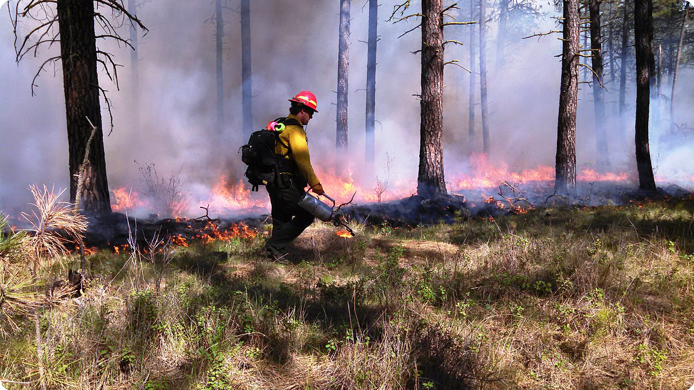
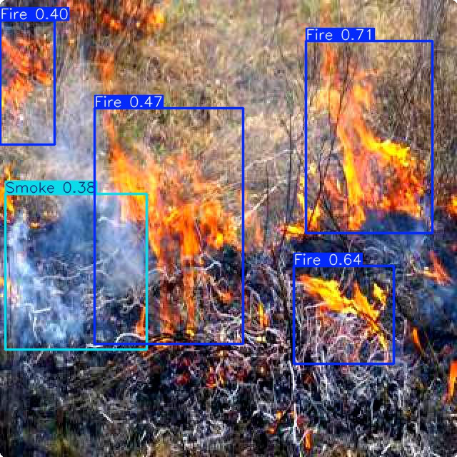
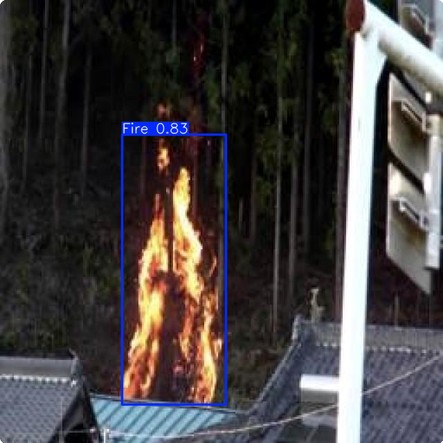
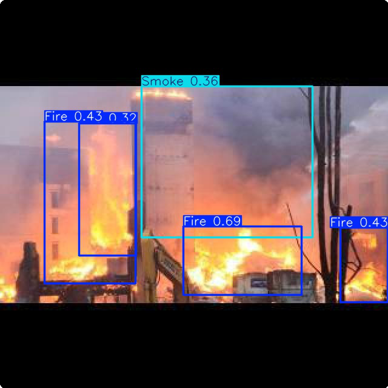
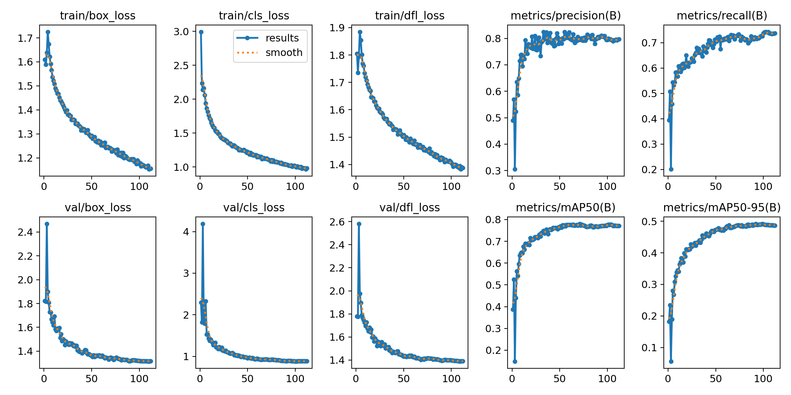
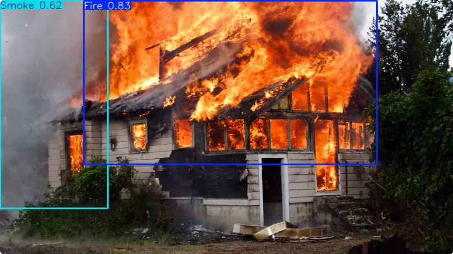

<div align="center">

# 🔥 Fire & Smoke Detection Web Application

### Real-Time Detection System with YOLO11 & Vue.js




[](https://render.com)
[](https://github.com/ultralytics/ultralytics)
[](https://github.com/ultralytics/ultralytics)

### 🚀 [**🔴 LIVE DEMO**](https://fire-smoke-webapp.onrender.com) | 📖 [Documentation](DEPLOYMENT.md) | ⭐ [GitHub Repository](https://github.com/cjbantillo/fire-smoke-webapp)

> **✅ Successfully Deployed!** Try the live fire detection system now →

</div>

## 📌 Table of Contents

1. [Introduction](#-real-time-web-based-fire-detection-system)
2. [Live Demo & Features](#-live-demo--features)
3. [Web Application Architecture](#-web-application-architecture)
4. [Model Performance](#-model-performance--training-summary)
5. [Quick Start](#-quick-start)
6. [Deployment](#-deployment)
7. [API Documentation](#-api-documentation)
8. [Troubleshooting](#-troubleshooting)
9. [Contributing](#-contributing)
10. [Credits & Attribution](#-credits--attribution)

## 🛡️ Real-Time Web-Based Fire Detection System

### 🌟 What Makes This Web Application Special

This project transforms cutting-edge fire detection research into a **production-ready web application** that anyone can use instantly through their browser. Built on top of the excellent YOLO11 fire detection model by [Sayed Gamal](https://github.com/sayedgamal99), we've added:

#### 🌐 **Zero-Installation Access**

- No software downloads required
- Works on any modern web browser
- Instant access via URL
- Cross-platform compatibility (Windows, Mac, Linux, Mobile)

#### 🔔 **Multi-Modal Alert System**

- **Audio Alerts:** Distinct beep patterns (Fire: 800Hz, Smoke: 400Hz)
- **Visual Notifications:** Browser push notifications with confidence scores
- **UI Feedback:** Real-time detection overlays and status indicators
- **History Panel:** Sliding notification panel with detection timeline

#### 📱 **Mobile-First Design**

- Touch-optimized interface
- Responsive layout for all screen sizes
- Mobile camera integration
- Optimized for smartphone usage

#### ⚡ **Real-Time Performance**

- WebSocket-powered live updates
- 30+ FPS video processing
- Instant detection feedback
- Smart cooldown system (3-second intervals)

### Problem & Solution

**Traditional fire detection systems** rely on physical sensors and are expensive to install and maintain. Our **web-based approach** democratizes fire safety by:

- **Accessibility:** Any device with a camera becomes a fire detector
- **Cost-Effective:** No hardware installation or maintenance
- **Instant Deployment:** Share a link, start protecting immediately
- **Remote Monitoring:** Monitor multiple locations from anywhere

### Key Web Application Features

🌐 **Browser-Based Interface**

- Modern, responsive Vue.js frontend
- Real-time webcam integration
- Mobile-friendly design
- No downloads required

🔔 **Smart Alert System**

- Audio alerts with different frequencies (Fire: 800Hz, Smoke: 400Hz)
- Browser push notifications
- Side-panel notification history
- Configurable alert settings

⚡ **Real-Time Performance**

- Live video processing at 30+ FPS
- Instant detection feedback
- WebSocket-powered real-time updates
- 3-second cooldown to prevent alert spam

🎯 **Production Ready**

- One-click deployment to Render
- Environment-based configuration
- Health monitoring endpoints
- Error handling and recovery

## 🌐 Live Demo & Features

### Web Application Interface

<div align="center">



</div>

### 🎮 Interactive Features

**🎥 Camera Modal**

- One-click webcam activation
- Real-time YOLO detection overlay
- Status monitoring and error handling
- Stop/start detection controls

**🔔 Alert System**

- Side notification panel with slide-in animation
- Audio beeps: Fire (800Hz) vs Smoke (400Hz)
- Browser notifications with confidence scores
- Alert history with timestamps

**📱 Mobile Responsive**

- Touch-friendly interface
- Optimized for mobile webcams
- Responsive notification panels
- Mobile-first design approach

## 🏗️ Web Application Architecture

```
┌─────────────────┐    ┌─────────────────┐    ┌─────────────────┐
│   Vue.js        │    │   Flask API     │    │   YOLO11        │
│   Frontend      │◄──►│   Backend       │◄──►│   Detection     │
│                 │    │                 │    │   Engine        │
│ • Camera Modal  │    │ • WebSocket     │    │ • Fire/Smoke    │
│ • Alert Panel   │    │ • Detection API │    │ • Real-time     │
│ • Notifications │    │ • Health Check  │    │ • Confidence    │
└─────────────────┘    └─────────────────┘    └─────────────────┘
```

### Technology Stack

**Frontend (Vue.js 3)**

- 📦 Vite build system
- 🎨 Mobile-responsive CSS
- 🔊 Web Audio API for alerts
- 📢 Browser Notification API
- 📡 WebSocket for real-time updates

**Backend (Flask + SocketIO)**

- 🐍 Python 3.9+ with Flask
- 🔌 WebSocket support
- 🎯 RESTful API endpoints
- 🔒 CORS enabled for web access
- 📊 Real-time detection polling

**AI/ML Pipeline**

- 🤖 YOLO11 Nano model (best_nano_111.pt)
- 📹 OpenCV for video processing
- ⚡ Real-time inference
- 🎯 Fire & Smoke classification

## 📊 Model Performance & Training Summary

> **Model Credits:** This project uses the fire detection model trained by [Sayed Gamal](https://github.com/sayedgamal99) from the original [Real-Time-Smoke-Fire-Detection-YOLO11](https://github.com/sayedgamal99/Real-Time-Smoke-Fire-Detection-YOLO11) repository.

### Training Performance

The model achieved excellent performance metrics suitable for real-time web applications:

<div align="center">

</div>

### Validation Results

| Metric        | Value     | Web App Impact           |
| ------------- | --------- | ------------------------ |
| Precision (P) | **0.806** | Fewer false alarms       |
| Recall (R)    | **0.717** | High detection rate      |
| mAP@50        | **0.770** | Reliable performance     |
| mAP@50-95     | **0.492** | Robust across thresholds |

### Class-Specific Performance

| Class     | Precision | Recall | mAP@50 | Web App Alerts              |
| --------- | --------- | ------ | ------ | --------------------------- |
| **Fire**  | 0.813     | 0.806  | 0.828  | 🔥 High-pitch beeps (800Hz) |
| **Smoke** | 0.800     | 0.629  | 0.711  | 💨 Low-pitch beeps (400Hz)  |

## 🚀 Quick Start

### Option 1: Local Development

#### Prerequisites

- Python 3.9+ installed
- Node.js 16+ installed
- Webcam or camera device
- Modern web browser (Chrome, Firefox, Safari, Edge)

#### Step-by-Step Setup

```bash
# 1. Clone the repository
git clone https://github.com/cjbantillo/fire-smoke-webapp.git
cd fire-smoke-webapp

# 2. Backend setup
pip install -r requirements.txt

# 3. Download the YOLO model (if not included)
# The model should be in models/best_nano_111.pt

# 4. Start the Flask backend
python app.py
# ✅ Backend running at http://localhost:5000

# 5. Frontend setup (new terminal)
cd frontend
npm install
npm run dev
# ✅ Frontend running at http://localhost:3000
```

#### First Run Checklist

- [ ] Camera permissions granted in browser
- [ ] Audio permissions enabled for alerts
- [ ] Browser notifications allowed
- [ ] YOLO model loaded successfully
- [ ] Both backend and frontend running

#### Testing the Application

1. **Open Browser:** Navigate to `http://localhost:3000`
2. **Camera Test:** Click "Start Detection" to activate webcam
3. **Detection Test:** Hold up a lighter or match (safely!) to test fire detection
4. **Audio Test:** Listen for different beep frequencies (Fire: 800Hz, Smoke: 400Hz)
5. **Notification Test:** Check browser notifications and side panel

### Option 2: One-Click Deployment

[](https://render.com/deploy)

1. Click the deploy button above
2. Connect your GitHub repository
3. Set environment variables
4. Deploy instantly

**See [DEPLOYMENT.md](DEPLOYMENT.md) for detailed instructions.**

## 🌐 Deployment

### Production Deployment on Render

The application is production-ready with the following configuration:

```yaml
# render.yaml
services:
  - type: web
    name: fire-detection-api
    env: python
    buildCommand: pip install -r requirements.txt
    startCommand: gunicorn --worker-class eventlet -w 1 --bind 0.0.0.0:$PORT app:app
```

### Environment Variables

```bash
PYTHON_VERSION=3.9.18
NODE_ENV=production
PORT=5000
```

### Health Monitoring

- **Health Check:** `/health`
- **Model Status:** Automatic validation
- **Camera Access:** Real-time verification
- **Error Recovery:** Automatic retries

## 📡 API Documentation

### Core Endpoints

| Method | Endpoint        | Description                    |
| ------ | --------------- | ------------------------------ |
| `GET`  | `/health`       | Health check and system status |
| `GET`  | `/detections`   | Get latest detection results   |
| `POST` | `/run-yolo`     | Start real-time detection      |
| `POST` | `/stop-yolo`    | Stop detection process         |
| `POST` | `/detect-frame` | Process single frame           |

### WebSocket Events

```javascript
// Real-time detection updates
socket.on("detection_results", (data) => {
  console.log("Detection:", data.type, data.confidence);
});

// System status updates
socket.on("status", (data) => {
  console.log("Status:", data.message);
});
```

### Example API Usage

```javascript
// Start detection
fetch("/run-yolo", {
  method: "POST",
  headers: { "Content-Type": "application/json" },
  body: JSON.stringify({
    model: "models/best_nano_111.pt",
    source: 0,
    conf: 0.35,
    iou: 0.1,
  }),
});

// Get detections
const response = await fetch("/detections");
const data = await response.json();
console.log("Recent detections:", data.detections);
```

## 🧪 Example Detections

### Web Application in Action

<div align="center">
 
</div>

### Command Line Testing

Test the model directly with YOLO commands:

```bash
# Test on image
yolo detect predict model=models/best_nano_111.pt source=data/house.png conf=0.35 iou=0.1

# Test with webcam
yolo detect predict model=models/best_nano_111.pt source=0 conf=0.35 iou=0.1 show=True
```

## 🔧 Technical Features

### Frontend (Vue.js)

- **Reactive UI:** Real-time detection feedback
- **Audio System:** Web Audio API with frequency generation
- **Notifications:** Browser notifications with confidence scores
- **Mobile Support:** Touch-friendly responsive design
- **Error Handling:** Graceful degradation and retry mechanisms

### Backend (Flask)

- **Real-time Processing:** Multi-threaded detection pipeline
- **WebSocket Support:** Live detection streaming
- **Production Ready:** Gunicorn with eventlet workers
- **Health Monitoring:** Comprehensive system status checks
- **CORS Enabled:** Cross-origin web application support

### AI Pipeline

- **Model:** YOLO11 Nano (optimized for speed)
- **Classes:** Fire, Smoke detection
- **Confidence:** 35% threshold for reliable detection
- **IoU:** 0.1 for precise bounding boxes
- **Performance:** 30+ FPS on modern hardware

## 🐛 Troubleshooting

### Common Issues & Solutions

#### 🔴 Camera Not Working

```bash
Error: "Camera not accessible" or black screen
```

**Solutions:**

- Grant camera permissions in browser settings
- Check if another application is using the camera
- Try different browsers (Chrome recommended)
- Restart browser and clear cache

#### 🔴 Audio Alerts Not Playing

```bash
Error: "Audio context not allowed"
```

**Solutions:**

- Click anywhere on the page to enable audio context
- Check browser sound settings
- Ensure device volume is turned up
- Try different browsers

#### 🔴 Model Loading Errors

```bash
Error: "Model file not found" or "YOLO model loading failed"
```

**Solutions:**

- Ensure `models/best_nano_111.pt` exists
- Check Git LFS setup for large files
- Verify Python dependencies: `pip install ultralytics`
- Download model manually if needed

#### 🔴 Detection Not Working

```bash
Issue: Camera shows but no detections appear
```

**Solutions:**

- Check confidence threshold (try lowering from 0.35 to 0.25)
- Ensure proper lighting conditions
- Test with obvious fire sources (lighter, candle)
- Check browser console for JavaScript errors

#### 🔴 Deployment Issues

```bash
Error: Build fails on Render or other platforms
```

**Solutions:**

- Check `requirements.txt` versions
- Verify environment variables are set
- Review deployment logs for specific errors
- Ensure Git LFS files are properly uploaded

### Performance Optimization

#### For Better Detection Accuracy:

- Ensure good lighting conditions
- Position camera at appropriate distance
- Use steady camera positioning
- Test with various fire/smoke sources

#### For Better Performance:

- Close other applications using camera
- Use modern browsers with WebRTC support
- Ensure stable internet connection for deployment
- Consider using desktop over mobile for testing

## 🤝 Contributing

We welcome contributions! This project combines web development with AI/ML, offering opportunities for various skill levels.

### How to Contribute

1. **🍴 Fork the Repository**
   ```bash
   git clone https://github.com/cjbantillo/fire-smoke-webapp.git
   cd fire-smoke-webapp
   ```

2. **🌿 Create Feature Branch**

   ```bash
   git checkout -b feature/amazing-feature
   ```

3. **💻 Make Changes**

   - Frontend: Vue.js components in `frontend/src/`
   - Backend: Flask routes in `app.py`
   - Documentation: Update README.md

4. **✅ Test Changes**

   ```bash
   # Test backend
   python app.py

   # Test frontend
   cd frontend && npm run dev
   ```

5. **📝 Commit Changes**

   ```bash
   git commit -m "Add amazing feature"
   git push origin feature/amazing-feature
   ```

6. **🔄 Create Pull Request**

### Contribution Areas

#### 🎨 Frontend Development

- UI/UX improvements
- Mobile responsiveness
- New alert mechanisms
- Performance optimization

#### 🔧 Backend Development

- API enhancements
- WebSocket improvements
- Model optimization
- Database integration

#### 🤖 AI/ML Improvements

- Model fine-tuning
- New detection classes
- Performance optimization
- Dataset improvements

#### 📚 Documentation

- API documentation
- Deployment guides
- Tutorial creation
- Code commenting

### Development Guidelines

- **Code Style:** Follow existing patterns
- **Testing:** Test all changes locally
- **Documentation:** Update relevant docs
- **Attribution:** Maintain original credits

## 📚 Credits & Attribution

### Original Model & Research

This web application builds upon the excellent fire detection model created by:

**🏆 [Sayed Gamal](https://github.com/sayedgamal99)**

- Original Repository: [Real-Time-Smoke-Fire-Detection-YOLO11](https://github.com/sayedgamal99/Real-Time-Smoke-Fire-Detection-YOLO11)
- Dataset: [Roboflow Fire & Smoke Detection](https://universe.roboflow.com/sayed-gamall/fire-smoke-detection-yolov11)
- Model Training: YOLO11 implementation and optimization
- Research: Fire detection methodology and validation

### Web Application Development

**🌐 Web Interface & Deployment**

- Vue.js frontend with real-time detection interface
- Flask API with WebSocket support
- Mobile-responsive design and alerts system
- Production deployment configuration for Render
- Browser-based audio and notification systems

### Resources & Frameworks

- **[Ultralytics YOLO11](https://github.com/ultralytics/ultralytics)** - Object detection framework
- **[Vue.js](https://vuejs.org/)** - Progressive JavaScript framework
- **[Flask](https://flask.palletsprojects.com/)** - Python web framework
- **[Render](https://render.com)** - Cloud deployment platform

---

<div align="center">

**🔥 Protect What Matters Most - Early Detection Saves Lives 🔥**

### [🚀 Try Live Demo](https://fire-smoke-webapp.onrender.com) | [📖 Deployment Guide](DEPLOYMENT.md) | [⭐ Star This Project](https://github.com/cjbantillo/fire-smoke-webapp)

**Made with ❤️ by developers who care about safety**

---

_This project is open source and welcomes contributions from the community. Together, we can make fire detection more accessible and effective._

</div>
